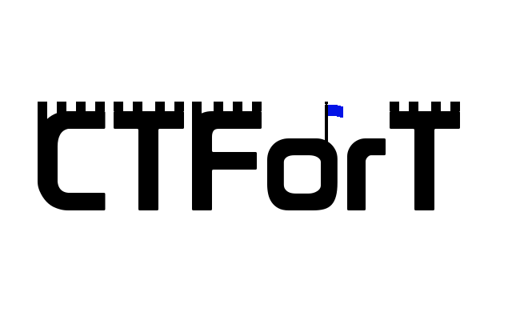

## Why Make CTFort?

Recently I had the chance participated in the [BSides Ottawa CTF](https://shorten.ninja/bsides) and while I had a great time I noticed a few issues, mainly the fact that the facebook CTF platform doesn't offer the ability to keep track of which flags have already been found. While the system does show the compromised countries it doesn't show which flag was actually captured. This lead to a few issues where people ended wasting time because there were both finding the same flag not knowing each other's progress.

## How does it work?

CTFort aims to act as a centralized progress tracker towards flag captures. All you need to do to get started is log in/register and then created a team. Once a team has been created, you can invite your friends using the provided indentation code. They just need to enter this code when joining the team and they will be in. Once a part of the team each of the members will have access to the various modules to enhance their CTF experience.